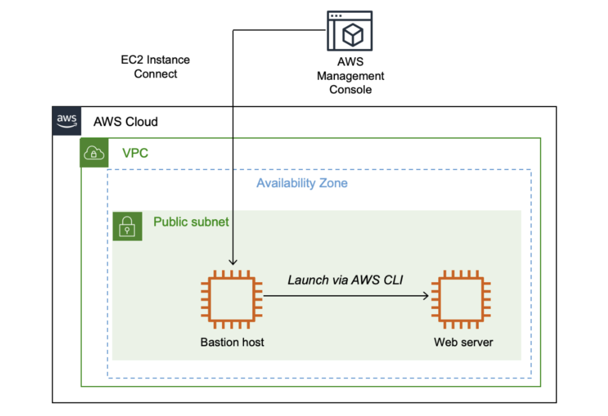

# Creating Amazon EC2 Instances

In this lab I learnt the following.
- How to launch an EC2 instance by using the AWS Management Console.
- How to connect to the EC2 instance by using EC2 Instance Connect.
- How to launch an EC2 instance by using the AWS CLI.

## Overview
AWS provides multiple ways to launch Amazon Elastic Compute Cloud (Amazon EC2) instance. 
In this lab, you use the AWS Management Console to launch an EC2 instance and then use it as a bastion host to launch another EC2 instance, which will be a web server. You use EC2 Instance Connect to securely connect to the bastion host and use the AWS Command Line Interface (AWS CLI) to launch a web server instance.
The following diagram illustrates the final architecture that you will build:



## Task 1: Launching an EC2 Instance by using the AWS Management Console
Here I launched an EC2 instance by using the AWS Management Console. The instance is a bastion host from which I can use the AWS CLI.

1. Set **Bastion host** in Name and tags section

When I name your instance, AWS creates a key-value pair. The key for this pair is Name, and the value is the name that you enter for your EC2 instance.

2. I kept **Amazon Linux 2** as AMI

An AMI includes the following:
- A template for the root volume for the instance (for example, an operating system or an application server with applications)
- Launch permissions that control which AWS accounts can use the AMI to launch instances
- A block device mapping that specifies the volumes to attach to the instance when it is launched

The Quick Start list contains the most commonly used AMIs bit it is also possible to create a custom AMI or select an AMI from the AWS Marketplace, an online store where you can sell or buy software that runs on AWS.

3. I kept **t3.micro** from the Instance type dropdown list.

An instance type determines the resources that will be allocated to your EC2 instance. Each instance type allocates a combination of virtual CPU, memory, disk storage, and network performance.

Instance types are divided into families, such as compute optimized, memory optimized, and storage optimized. The name of the instance type includes a family identifier, such as T3 and M5. The number indicates the generation of the instance, so M5 is newer than M4.

My application uses a t3.micro instance type, which is a small instance that can burst above baseline performance when it is busy. It is suitable for development and testing purposes and for applications that have bursty workloads.

4.  I selected **Proceed without key pair (Not recommended)** in the Key pair (login) section, from the Key pair name - required dropdown list.

Amazon EC2 uses public key cryptography to encrypt and decrypt login information. To log in to my instance, I must create a key pair, specify the name of the key pair when you launch the instance, and provide the private key when you connect to the instance.

I do not required a key pair here because I used EC2 Instance Connect to log in to my instance.

5. In the network settings, I seleceted **Lab VPC** for VPC.

The virtual private cloud (VPC) indicates which VPC I want to launch the instance into. An instance can have multiple VPCs, including different ones for development, testing, and production.

I launched the instance in a public subnet within the Lab VPC network.

6. In the network settings, I gave a name and description for the **Security Group**.
- Name: Bastion security group
- Description: Permit SSH connections

A security group acts as a virtual firewall that controls the traffic for one or more instances. When an instance is launched, one or more security groups are associated with the instance. I added rules to each security group that allow traffic to or from its associated instances. I can modify the rules for a security group at any time; the new rules are automatically applied to all instances that are associated with the security group.

7. I kept the default **8 gibibyte (GiB) disk volume** in the Configure storage pane.

In the configure storage it is possible to add additional Amazon Elastic Block Store (Amazon EBS) disk volumes and configure their size and performance. 
The EC2 instance is launched using a default 8 gibibyte (GiB) disk volume. This is called root volume (also known as a boot volume).

8. From IAM instance profile dropdown list, under the Advanced details pane, I chose **Bastion-Role**.

The Bastion-Role profile grants permission to applications running on the instance to make requests to the Amazon EC2 service. This association of Role is required for the second half of this lab, where you use the AWS CLI to communicate with the Amazon EC2 service.

9. After reviewing the instance configuration details in the Summary section, I clicked **Launch instance**.


## Task 2: Connect to the bastion host using the Management Console
Here I used EC2 Instance Connect to log in to the bastion host that created in the previous task.

1. On the EC2 Management Console, from the list of EC2 instances displayed, I selected the check box for the bastion host instance.
2. On the EC2 Instance Connect tab, I clicled **Connect** to connect to the bastion host.


## Task 3: Launching an EC2 instance using the AWS CLI
Here I launched an EC2 instance using the AWS CLI. With the AWS CLI, I can automate the provisioning and configuration of AWS resources.

These are the parameters I gave to the to the command to successfully run it and launch.

1.  Code to retrieve **AMI**.
```bash
[ec2-user@ip-10-0-0-4 ~]$ #Set the Region
AZ=`curl -s http://169.254.169.254/latest/meta-data/placement/availability-zone`
export AWS_DEFAULT_REGION=${AZ::-1}
#Retrieve latest Linux AMI
AMI=$(aws ssm get-parameters --names /aws/service/ami-amazon-linux-latest/amzn2-ami-hvm-x86_64-gp2 --query 'Parameters[0].[Value]' --output text)
echo $AMI
-bash: -1: substring expression < 0
ami-0534a0fd33c655746
```
The AMI ID is stored in the AMI environment variable  with value `ami-0534a0fd33c655746`.

The AMI populates the boot disk of the instance. AWS continually patches and updates AMIs, so it is recommended to always use the latest AMI when launching instances.

3. Code to retrieve the **subnet ID** for the public subnet.
```bash
[ec2-user@ip-10-0-0-4 ~]$ SUBNET=$(aws ec2 describe-subnets --filters 'Name=tag:Name,Values=Public Subnet' --query Subnets[].SubnetId --output text)
echo $SUBNET
subnet-023c88579152b3533
```
The subnet ID is stored in the SUBNET environment variable  with value `subnet-023c88579152b3533`.

4.  Code to retrieve the **security group**, which allows inbound HTTP requests.
```bash
[ec2-user@ip-10-0-0-4 ~]$ SG=$(aws ec2 describe-security-groups --filters Name=group-name,Values=WebSecurityGroup --query SecurityGroups[].GroupId --output text)
echo $SG
sg-04a3e8c90c93579ff
```
The security group ID is stored in the SG environment variable with value `sg-04a3e8c90c93579ff`.

5. Code to download a **user data script**.
```bash
[ec2-user@ip-10-0-0-4 ~]$ wget https://aws-tc-largeobjects.s3.us-west-2.amazonaws.com/CUR-TF-100-RSJAWS-1-23732/171-lab-JAWS-create-ec2/s3/UserData.txt
--2026-03-16 16:01:48--  https://aws-tc-largeobjects.s3.us-west-2.amazonaws.com/CUR-TF-100-RSJAWS-1-23732/171-lab-JAWS-create-ec2/s3/UserData.txt
Resolving aws-tc-largeobjects.s3.us-west-2.amazonaws.com (aws-tc-largeobjects.s3.us-west-2.amazonaws.com)... 52.218.176.73, 52.218.219.17, 3.5.77.183, ...
Connecting to aws-tc-largeobjects.s3.us-west-2.amazonaws.com (aws-tc-largeobjects.s3.us-west-2.amazonaws.com)|52.218.176.73|:443... connected.
HTTP request sent, awaiting response... 200 OK
Length: 327 [text/plain]
Saving to: ‘UserData.txt’

UserData.txt                                 100%[==============================================================================================>]     327  --.-KB/s    in 0.001s  

2026-03-16 16:01:48 (432 KB/s) - ‘UserData.txt’ saved [327/327]
```
The output was saved in a file called **UserData.txt** with the following content.
```bash
#!/bin/bash
# Install Apache Web Server
yum install -y httpd

# Turn on web server
systemctl enable httpd.service
systemctl start  httpd.service

# Download App files
wget https://aws-tc-largeobjects.s3.amazonaws.com/CUR-TF-100-RESTRT-1/171-lab-%5BJAWS%5D-create-ec2/dashboard-app.zip
unzip dashboard-app.zip -d /var/www/html/
```
The script above installs a web server, downloads a .zip file containing the web application and installs the web application.

6. Eventually I launched the instance.
```bash
[ec2-user@ip-10-0-0-4 ~]$ INSTANCE=$(\
aws ec2 run-instances \
--image-id $AMI \
--subnet-id $SUBNET \
--security-group-ids $SG \
--user-data file:///home/ec2-user/UserData.txt \
--instance-type t3.micro \
--tag-specifications 'ResourceType=instance,Tags=[{Key=Name,Value=Web Server}]' \
--query 'Instances[*].InstanceId' \
--output text \
)
echo $INSTANCE
i-0ee7181007c9db1c1
```
Output: The ID of the new instance is stored in the INSTANCE environment variable with value `-0ee7181007c9db1c1`.

The run-instances command launched a new instance using the parameters I retrieved before:
- **Image**: Uses the AMI value obtained earlier from Parameter Store
- **Subnet**: Specifies the public subnet retrieved earlier and, by association, the VPC in which to launch the instance
- **Security group**: Uses the web security group retrieved earlier, which permits HTTP access
- **User data**: References the user data script that you downloaded, which installs the web application
- **Instance type**: Specifies the type of instance to launch
- **Tags**: Assigns a name tag with the value of **Web Server**

The query parameter specifies that the command should return the instance ID once the instance is launched.

The output parameter specifies that the output of the command should be in text. Other output options are json and table.

7.  When the new instance to be ready I can check the details using the AWC CLI command `aws ec2 describe-instances`.
```bash
[ec2-user@ip-10-0-0-4 ~]$ aws ec2 describe-instances --instance-ids $INSTANCE
{
    "Reservations": [
        {
            "ReservationId": "r-063bac56f03e017d3",
            "OwnerId": "286589080824",
            "Groups": [],
            "Instances": [
                {
....
```
Or I can just print the status with the option `--query 'Reservations[].Instances[].State.Name'`.
```bash
[ec2-user@ip-10-0-0-4 ~]$ aws ec2 describe-instances --instance-ids $INSTANCE --query 'Reservations[].Instances[].State.Name' --output text
running
```
Possible values for the status are pending or running.

8.  Test the web server

To get the public IPv4 Domain Name System (DNS) name of the instance I used the option `--query Reservations[].Instances[].PublicDnsName`.
```bash
[ec2-user@ip-10-0-0-4 ~]$ aws ec2 describe-instances --instance-ids $INSTANCE --query Reservations[].Instances[].PublicDnsName --output text
ec2-54-69-44-211.us-west-2.compute.amazonaws.com
```
I copied and pasted the DNS name into a new web browser.


I also checked all instances in the Amazon EC2 management console.


## Conclusion
Which method should you use?
- Launch from the management console when you quickly need to launch a one-off or temporary instance.
- Launch by using a script when you need to automate the creation of an instance in a repeatable, reliable manner.
- Launch by using CloudFormation when you want to launch related resources together.

## Optional challenge 1: Connect to an EC2 instance

## Optional challenge 2: Fix the web server installation


