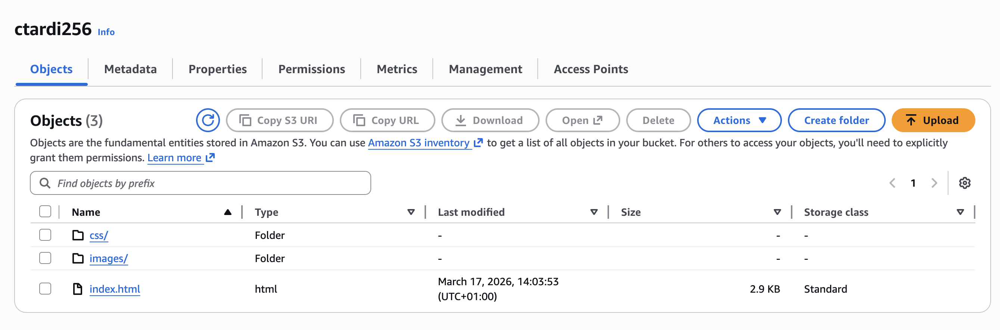
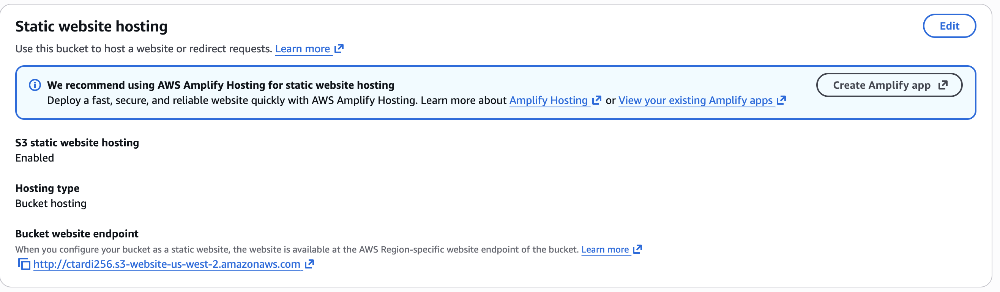
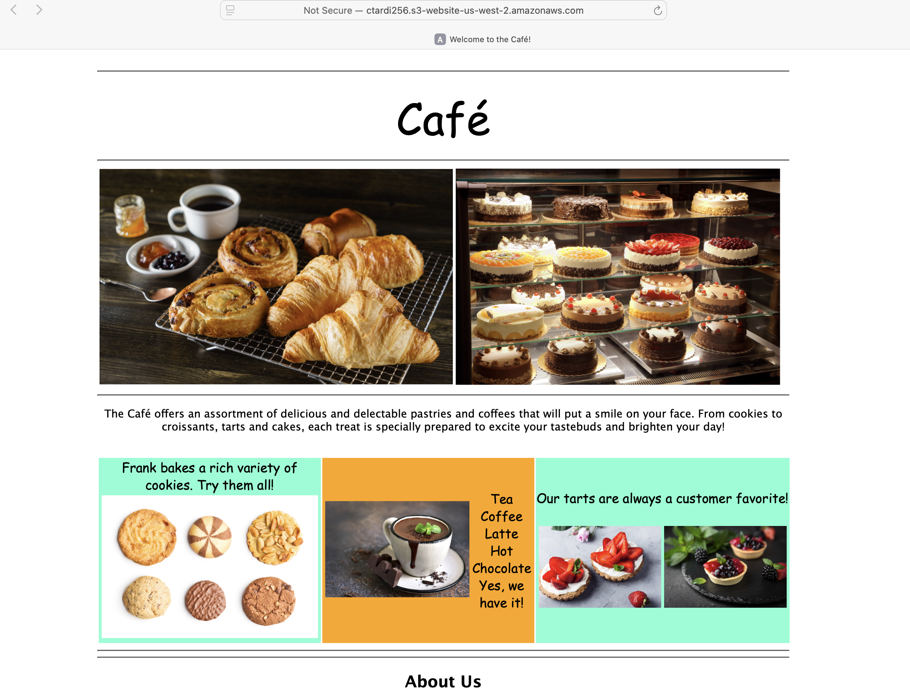

# Creating a Website on S3

In this lab I used the AWS Command Line Interface (AWS CLI) commands from an Amazon Elastic Compute Cloud (Amazon EC2) instance to:
- Create an Amazon Simple Storage Service (Amazon S3) bucket.
- Create a new AWS Identity and Access Management (IAM) user that has full access to the Amazon S3 service.
- Upload files to Amazon S3 to host a simple website for the Café & Bakery.
- Create a batch file that can be used to update the static website when you change any of the website files locally.


## Task 1: Connect to an Amazon Linux EC2 instance using SSM
From the lab, I opened the **InstanceSessionUrl** and typed:
```bash
sh-4.2$ sudo su -l ec2-user
[ec2-user@ip-10-200-0-238 ~]$ pwd
/home/ec2-user
```

## Task 2: Configure the AWS CLI
Amazon Linux has already **AWS CLI** pre-installed. I run the command `aws configure` to update the AWS CLI software with credentials.
```bash
[ec2-user@ip-10-200-0-238 ~]$ aws configure
AWS Access Key ID [None]: <from lab details>
AWS Secret Access Key [None]: <from lab details>
Default region name [None]: us-west-2
Default output format [None]: json
```

## Task 3: Create an S3 bucket using the AWS CLI
The `s3api` command creates a new **S3 bucket** with the AWS credentials in this lab. By default, the S3 bucket is created in the us-east-1 Region.
Bucket must have a unique name, here I used `ctardi256`.
```bash
[ec2-user@ip-10-200-0-238 ~]$ aws s3api create-bucket --bucket ctardi256 --region us-west-2 --create-bucket-configuration LocationConstraint=us-west-2
{
    "Location": "http://ctardi256.s3.amazonaws.com/"
}
```

## Task 4: Create a new IAM user that has full access to Amazon S3
The AWS CLI command `aws iam create-user` creates a new IAM user for your AWS account. The option `--user-name` is used to create the name of the user and must be unique within the account.
```bash
[ec2-user@ip-10-200-0-238 ~]$ aws iam create-user --user-name awsS3user
{
    "User": {
        "UserName": "awsS3user",
        "Path": "/",
        "CreateDate": "2026-03-17T12:47:40Z",
        "UserId": "AIDA2UO2Z7OSQBN4LDIQQ",
        "Arn": "arn:aws:iam::731140193189:user/awsS3user"
    }
}
```
Then the AWS CLI command `aws iam create-login-profile` creates a login profile for the new user.
```bash
[ec2-user@ip-10-200-0-238 ~]$ aws iam create-login-profile --user-name awsS3user --password Training123!
{
    "LoginProfile": {
        "UserName": "awsS3user",
        "CreateDate": "2026-03-17T12:47:43Z",
        "PasswordResetRequired": false
    }
}
```
I login in with the new IAM user credentials:
- Account ID: ID of the account VocLabsUser from the AWS Management Console (731140193189)
- IAM user name: awsS3user
- password: Training123!

The IAM user didn't have access to the S3 bucket. Using the terminal I serach policy that grants full access to Amazon S3.
```bash
sh-4.2$ aws iam list-policies --query "Policies[?contains(PolicyName,'S3')]"
[
    {
        "PolicyName": "AmazonS3FullAccess",
        "PermissionsBoundaryUsageCount": 0,
        "CreateDate": "2015-02-06T18:40:58Z",
        "AttachmentCount": 0,
        "IsAttachable": true,
        "PolicyId": "ANPAIFIR6V6BVTRAHWINE",
        "DefaultVersionId": "v2",
        "Path": "/",
        "Arn": "arn:aws:iam::aws:policy/AmazonS3FullAccess",
        "UpdateDate": "2021-09-27T20:16:37Z"
    },
...
```
And after I found the policy, I assigned it to the IAM user.
```bash
[ec2-user@ip-10-200-0-238 ~]$ aws iam attach-user-policy --policy-arn arn:aws:iam::aws:policy/AmazonS3FullAccess --user-name awsS3user
```

## Task 5: Adjust S3 bucket permissions
I changed the permission for the S3 bucket:
- Under Block public access (bucket settings), Block all public access: unchecked
- Under Object Ownership, ACLs enabled: selected
- Under Object Ownership, I acknowledge that ACLs will be restored: selected

## Task 6: Extract the files that you need for this lab
I extracted the file containing the static-website contents for the Amazon S3 bucket using the CLI.
```bash
[ec2-user@ip-10-200-0-238 ~]$ cd ~/sysops-activity-files
[ec2-user@ip-10-200-0-238 sysops-activity-files]$ tar xvzf static-website-v2.tar.gz
static-website/
static-website/css/
static-website/css/styles.css
static-website/images/
static-website/images/Cafe-Owners.png
static-website/images/Cake-Vitrine.png
static-website/images/Coffee-and-Pastries.png
static-website/images/Coffee-Shop.png
static-website/images/Cookies.png
static-website/images/Cup-of-Hot-Chocolate.png
static-website/images/Strawberry-&-Blueberry-Tarts.png
static-website/images/Strawberry-Tarts.png
static-website/index.html
[ec2-user@ip-10-200-0-238 sysops-activity-files]$ cd static-website
```
Among the files, there is one called `index.html`.

## Task 7: Upload files to Amazon S3 by using the AWS CLI
The files are extracted, you upload the contents of the file to Amazon S3 using the `s3` command. s3 commands are built on top of the operations that are found in the s3api commands.
1. In order to the the bucket to function as a website, I run the command `aws s3 website` with option `--index-document`. This process helps ensure that the index.html file will be known as the index document.
```bash
[ec2-user@ip-10-200-0-238 static-website]$ aws s3 website s3://ctardi256 --index-document index.html
```
2. To upload the files to the bucket, I run the command `aws s3 cp` with option `--recursive --acl public-read`. The access control list (ACL) parameter specifies that the uploaded files have public read access. It also includes the recursive parameter, which indicates that all files in the current directory on your machine should be uploaded.
```bash
[ec2-user@ip-10-200-0-238 static-website]$ aws s3 cp /home/ec2-user/sysops-activity-files/static-website/ s3://ctardi256/ --recursive --acl public-read
upload: css/styles.css to s3://ctardi256/css/styles.css
upload: images/Coffee-Shop.png to s3://ctardi256/images/Coffee-Shop.png
upload: ./index.html to s3://ctardi256/index.html
upload: images/Cafe-Owners.png to s3://ctardi256/images/Cafe-Owners.png
upload: images/Cake-Vitrine.png to s3://ctardi256/images/Cake-Vitrine.png
upload: images/Coffee-and-Pastries.png to s3://ctardi256/images/Coffee-and-Pastries.png
upload: images/Cookies.png to s3://ctardi256/images/Cookies.png
upload: images/Strawberry-Tarts.png to s3://ctardi256/images/Strawberry-Tarts.png
upload: images/Cup-of-Hot-Chocolate.png to s3://ctardi256/images/Cup-of-Hot-Chocolate.png
upload: images/Strawberry-&-Blueberry-Tarts.png to s3://ctardi256/images/Strawberry-&-Blueberry-Tarts.png
```
3. To verify that all files were successfully uploaded I run the command `aws s3 ls ctardi256`.
```bash
[ec2-user@ip-10-200-0-238 static-website]$ aws s3 ls ctardi256
                           PRE css/
                           PRE images/
2026-03-17 13:03:53       2980 index.html
```


4. On AWS Management Console I checked that the Static website hosting is Enabled.



6. And here it is the bucket website endpoint URL in the browser!



## Task 8: Create a batch file to make updating the website repeatable
1. To create a repeatable deployment, I created a batch file called `update-website.sh` in the home directory.
```bash
#!/bin/bash
aws s3 cp /home/ec2-user/sysops-activity-files/static-website/ s3://ctardi256/ --recursive --acl public-read
```
And made the file executable `chmod +x update-website.sh`.

2. Then I made some changes to the `sysops-activity-files/static-website/index.html` file:
- bgcolor="aquamarine" to bgcolor="gainsboro"
- bgcolor="orange" to bgcolor="cornsilk"
- bgcolor="aquamarine" to bgcolor="gainsboro"

3. Eventually, I run your batch file to update the website.
```bash
[ec2-user@ip-10-200-0-238 ~]$ ./update-website.sh
upload: sysops-activity-files/static-website/css/styles.css to s3://ctardi256/css/styles.css
upload: sysops-activity-files/static-website/images/Coffee-Shop.png to s3://ctardi256/images/Coffee-Shop.png
upload: sysops-activity-files/static-website/images/Cafe-Owners.png to s3://ctardi256/images/Cafe-Owners.png
upload: sysops-activity-files/static-website/images/Cookies.png to s3://ctardi256/images/Cookies.png
upload: sysops-activity-files/static-website/index.html to s3://ctardi256/index.html
upload: sysops-activity-files/static-website/images/Coffee-and-Pastries.png to s3://ctardi256/images/Coffee-and-Pastries.png
upload: sysops-activity-files/static-website/images/Strawberry-&-Blueberry-Tarts.png to s3://ctardi256/images/Strawberry-&-Blueberry-Tarts.png
upload: sysops-activity-files/static-website/images/Cake-Vitrine.png to s3://ctardi256/images/Cake-Vitrine.png
upload: sysops-activity-files/static-website/images/Strawberry-Tarts.png to s3://ctardi256/images/Strawberry-Tarts.png
upload: sysops-activity-files/static-website/images/Cup-of-Hot-Chocolate.png to s3://ctardi256/images/Cup-of-Hot-Chocolate.png
```

4. And here it is the uodated website!


## Optional challenge
Using the `aws s3 sync` command to only copy the files that have been modified to the `S3 bucket` increases efficiency.
Only modified files were copied.
```bash
[ec2-user@ip-10-200-0-238 ~]$ aws s3 sync /home/ec2-user/sysops-activity-files/static-website/ s3://ctardi256/ --acl public-read
upload: sysops-activity-files/static-website/index.html to s3://ctardi256/index.html
```

# Conclusion
With this lab I learnt how to:
- Run AWS CLI commands that use IAM and Amazon S3 services.
- Deploy a static website to an S3 bucket.
- Create a script that uses the AWS CLI to copy files in a local directory to Amazon S3.
