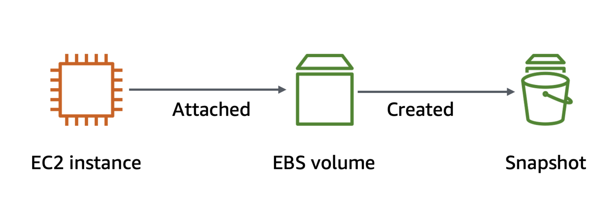
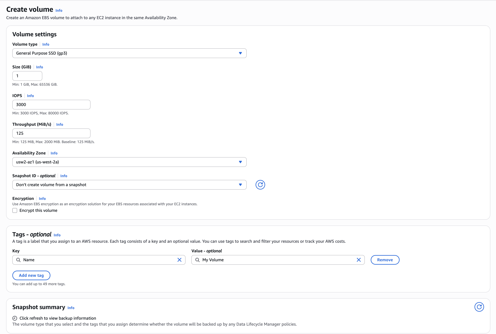
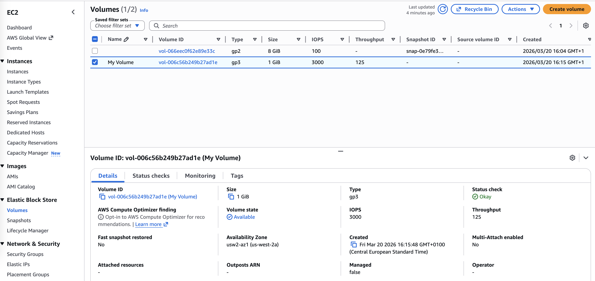
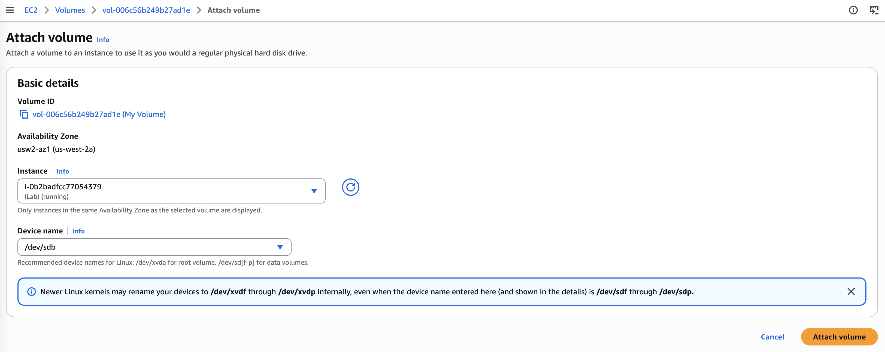
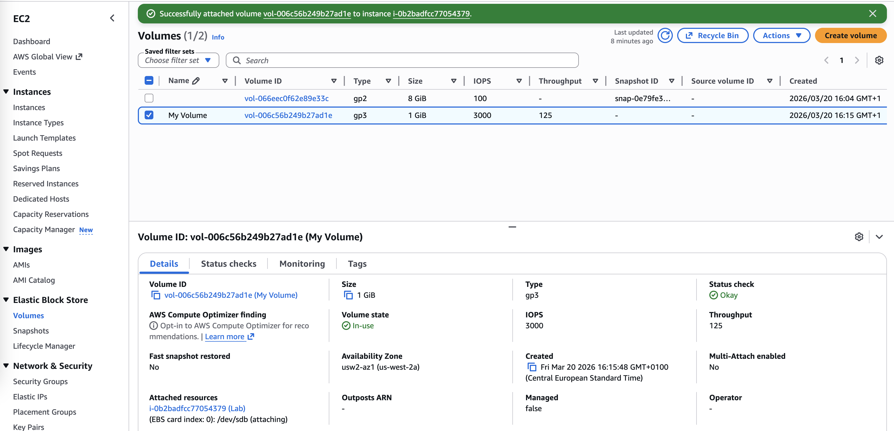
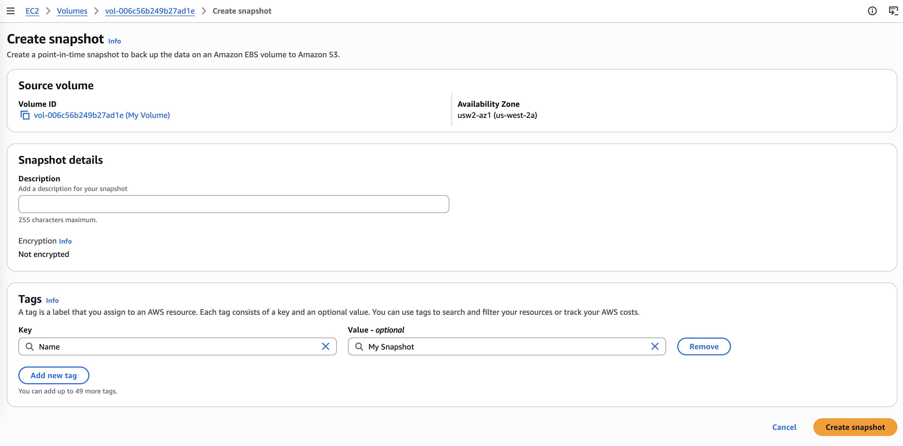
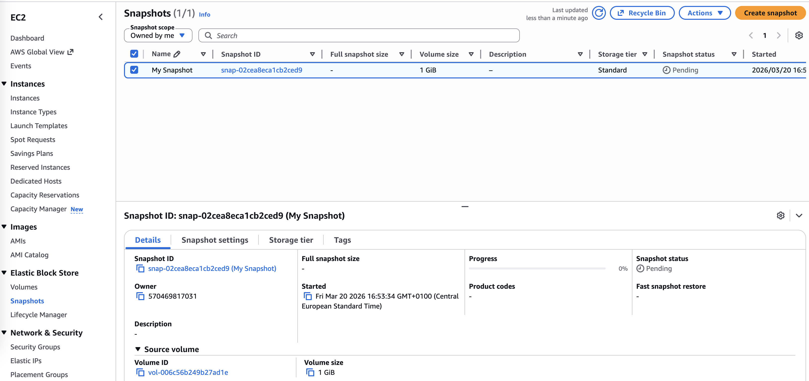
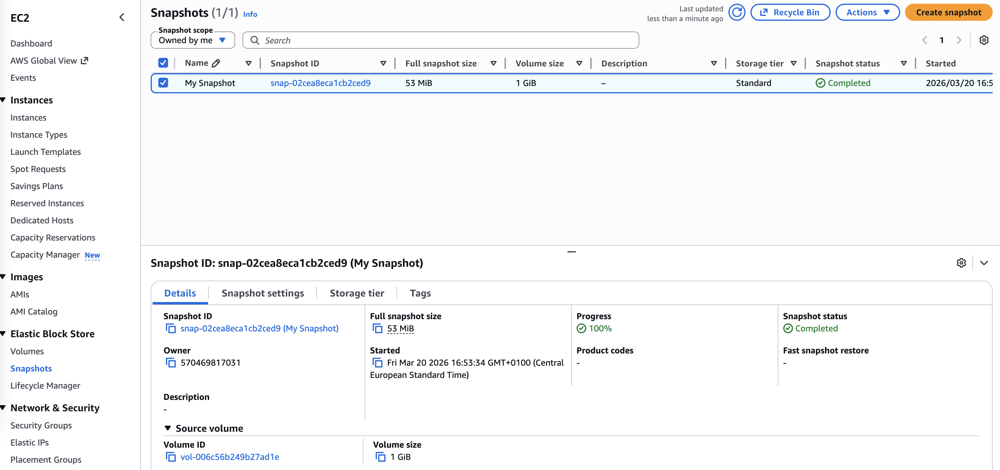

# Working with Amazon EBS

Amazon Elastic Block Store (Amazon EBS) is a scalable, high-performance block-storage service that is designed for Amazon Elastic Compute Cloud (Amazon EC2). In this lab, I will create an EBS volume and perform operations on it, such as attaching it to an instance, creating a file system, and taking a snapshot backup.



## Objectives
- Create an EBS volume.
- Attach and mount an EBS volume to an EC2 instance.
- Create a snapshot of an EBS volume.
- Create an EBS volume from a snapshot.

## Task 1: Creating a new EBS volume
An EC2 instance named **Lab** has already been launched for this lab in the **Availability Zone** `us-west-2a`.
In the left navigation pane, for **Elastic Block Store**, I choose Volumes. I see an existing (8 GiB) volume that the EC2 instance is using.
I click **Create Volune** to add a new volume to the instance. I use the following options:
- **Volume type**: `General Purpose SSD (gp2)`.
- **Size (GiB)**: `1`. 
- **Availability Zone**: `us-west-2a`
- **Tag (optional)**:
    - **Key**: `Name`
    - **Value**: `My Volume`



I wait for the **Volume state** to became *Available*.



## Task 2: Attaching the volume to an EC2 instance
Now I attach my new volume to the EC2 instance. I use these options:
- **Instance**: `Lab`
- **Device name**: `/dev/sdb`



I wait for the **Volume state** to became *In Use*.



## Task 3: Connecting to the Lab EC2 instance
I connect to the instance **Lab** using the **EC2 Instance Connect**.
```bash
   ,     #_
   ~\_  ####_        Amazon Linux 2
  ~~  \_#####\
  ~~     \###|       AL2 End of Life is 2026-06-30.
  ~~       \#/ ___
   ~~       V~' '->
    ~~~         /    A newer version of Amazon Linux is available!
      ~~._.   _/
         _/ _/       Amazon Linux 2023, GA and supported until 2028-03-15.
       _/m/'           https://aws.amazon.com/linux/amazon-linux-2023/

[ec2-user@ip-10-1-11-241 ~]$
```

## Task 4: Creating and configuring the file system
Here I will add the new volume to a Linux instance as an ext3 file system under the /mnt/data-store mount point.

1. I see the storage that is available on my instance using the command `df -h`.
```bash
[ec2-user@ip-10-1-11-241 ~]$ df -h
Filesystem      Size  Used Avail Use% Mounted on
devtmpfs        460M     0  460M   0% /dev
tmpfs           471M     0  471M   0% /dev/shm
tmpfs           471M  408K  470M   1% /run
tmpfs           471M     0  471M   0% /sys/fs/cgroup
/dev/nvme0n1p1  8.0G  1.8G  6.3G  22% /
tmpfs            95M     0   95M   0% /run/user/1000
```

2. I create an ext3 file system on the new volume.
```bash
[ec2-user@ip-10-1-11-241 ~]$ sudo mkfs -t ext3 /dev/sdb
mke2fs 1.42.9 (28-Dec-2013)
Filesystem label=
OS type: Linux
Block size=4096 (log=2)
Fragment size=4096 (log=2)
Stride=0 blocks, Stripe width=0 blocks
65536 inodes, 262144 blocks
13107 blocks (5.00%) reserved for the super user
First data block=0
Maximum filesystem blocks=268435456
8 block groups
32768 blocks per group, 32768 fragments per group
8192 inodes per group
Superblock backups stored on blocks: 
        32768, 98304, 163840, 229376

Allocating group tables: done                            
Writing inode tables: done                            
Creating journal (8192 blocks): done
Writing superblocks and filesystem accounting information: done
```

3. I create directory to mount the new storage volume.
```bash
[ec2-user@ip-10-1-11-241 ~]$ sudo mkdir /mnt/data-store
```

4. Eventually I mount the new volume and I ensures that the volume is mounted even after the instance is restarted.
```bash
[ec2-user@ip-10-1-11-241 ~]$ sudo mount /dev/sdb /mnt/data-store
[ec2-user@ip-10-1-11-241 ~]$ echo "/dev/sdb   /mnt/data-store ext3 defaults,noatime 1 2" | sudo tee -a /etc/fstab
/dev/sdb   /mnt/data-store ext3 defaults,noatime 1 2
```

5. Here it is the configuration file.
```bash
[ec2-user@ip-10-1-11-241 ~]$ cat /etc/fstab
#
UUID=76daed67-6a92-496e-bde2-c80af05b785d     /           xfs    defaults,noatime  1   1
/dev/sdb   /mnt/data-store ext3 defaults,noatime 1 2
```
6.  A new storage, `/dev/nvme1n1`, is available on my instance.
```bash
[ec2-user@ip-10-1-11-241 ~]$ df -h
Filesystem      Size  Used Avail Use% Mounted on
devtmpfs        460M     0  460M   0% /dev
tmpfs           471M     0  471M   0% /dev/shm
tmpfs           471M  408K  470M   1% /run
tmpfs           471M     0  471M   0% /sys/fs/cgroup
/dev/nvme0n1p1  8.0G  1.8G  6.3G  22% /
tmpfs            95M     0   95M   0% /run/user/1000
/dev/nvme1n1    975M   60K  924M   1% /mnt/data-store
```
7. I create a file and add some text on the mounted volume.
```bash
sudo sh -c "echo some text has been written > /mnt/data-store/file.txt"
```

List of commands:
```bash
df -h
sudo mkfs -t ext3 /dev/sdb
sudo mkdir /mnt/data-store
sudo mount /dev/sdb /mnt/data-store
echo "/dev/sdb   /mnt/data-store ext3 defaults,noatime 1 2" | sudo tee -a /etc/fstab
cat /etc/fstab
df -h
sudo sh -c "echo some text has been written > /mnt/data-store/file.txt"
cat /mnt/data-store/file.txt
```

## Task 5: Creating an Amazon EBS snapshot
Amazon EBS snapshots are stored in Amazon Simple Storage Service (Amazon S3) for durability. New EBS volumes can be created out of snapshots for cloning or restoring backups. Amazon EBS snapshots can also be shared among Amazon Web Services (AWS) accounts or copied over AWS Regions.

1. Create the snapshot.



2. The Snapshot status of my snapshot is *Pending*. 



3. After completion, the status changes to *Completed*. Only used storage blocks are copied to snapshots, so empty blocks do not use any snapshot storage space.



4. In my EC2 Instance Connect terminal window, I delete the file on my volume.
```bash
[ec2-user@ip-10-1-11-241 ~]$ sudo rm /mnt/data-store/file.txt
[ec2-user@ip-10-1-11-241 ~]$ ls /mnt/data-store/file.txt
ls: cannot access /mnt/data-store/file.txt: No such file or directory
```

## Task 6: Restoring the Amazon EBS snapshot

- Task 6.1: Creating a volume by using the snapshot
- Task 6.2: Attaching the restored volume to the EC2 instance
- Task 6.3: Mounting the restored volume

## Conclusion
In this lab I learnt how to:
- create an EBS volume
- mount an EBS volume to an EC2 instance
- create a snapshot of an EBS volume
- create an EBS volume from a snapshot

