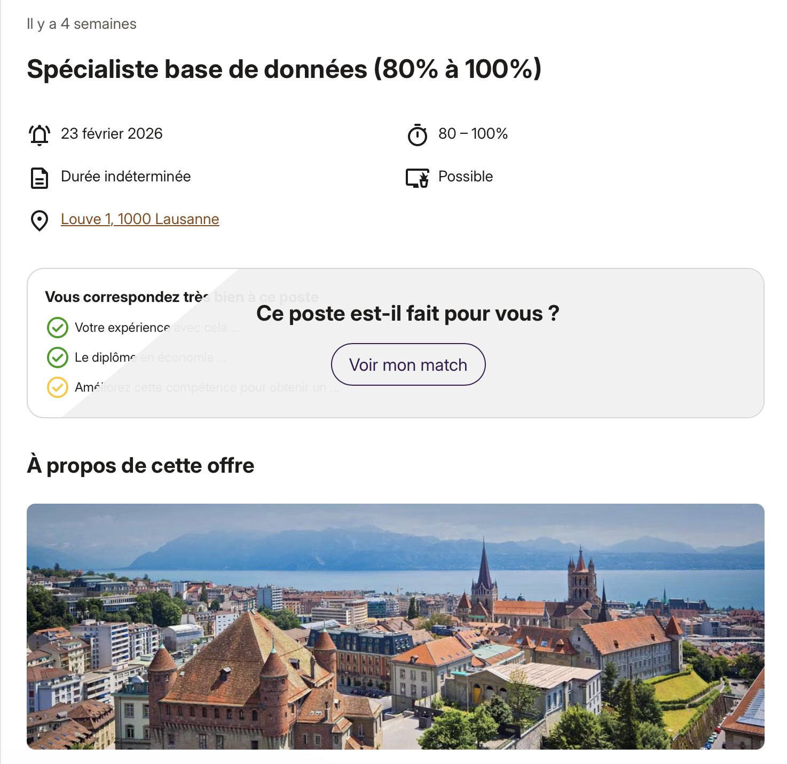

# Challenge Lab: Amazon S3
In this challenge lab, I will create an Amazon Simple Storage Service (Amazon S3) bucket and perform some routine tasks, 
such as uploading objects and configuring permissions to make those objects publicly accessible through a browser.

## Objectives
- Create an S3 bucket. 
- Upload an object into this bucket. 
- Access the object by using a web browser. 
- List the contents of the S3 bucket by using the AWS Command Line Interface (AWS CLI).

## Task 1: Connecting to the CLI Host instance
On the AWS Management Console, in the Search bar, I enter and choose EC2 to open the EC2 Management Console.
Then I select **CLI Host** instance from the available instances and choose Connect.
On the EC2 Instance Connect tab, I click Connect.
```bash

```

## Task 2: Configuring the AWS CLI
To set up the AWS CLI profile with credentials I run the command `aws configure` with options:
- **AWS Access Key ID**:`AccessKey`
- **AWS Secret Access Key**: `SecretKey`
- **Default region name**: `us-west-2`
- **Default output format**: `json`

```bash
  ,     #_
   ~\_  ####_        Amazon Linux 2
  ~~  \_#####\
  ~~     \###|       AL2 End of Life is 2026-06-30.
  ~~       \#/ ___
   ~~       V~' '->
    ~~~         /    A newer version of Amazon Linux is available!
      ~~._.   _/
         _/ _/       Amazon Linux 2023, GA and supported until 2028-03-15.
       _/m/'           https://aws.amazon.com/linux/amazon-linux-2023/

[ec2-user@ip-10-200-0-239 ~]$ aws configure
AWS Access Key ID [None]: <AccessKey>
AWS Secret Access Key [None]: <SecretKey>
Default region name [None]: us-west-2
Default output format [None]: json
```

## Task 3: Finishing the challenge

1. I create an S3 bucket.
```bash
[ec2-user@ip-10-200-0-239 ~]$ # Set bucket name
[ec2-user@ip-10-200-0-239 ~]$ BUCKET_NAME="challenge-ct-2026-03-23"
[ec2-user@ip-10-200-0-239 ~]$ echo $BUCKET_NAME
challenge-ct-2026-03-23
[ec2-user@ip-10-200-0-239 ~]$ 
[ec2-user@ip-10-200-0-239 ~]$ # Create buckect
[ec2-user@ip-10-200-0-239 ~]$ aws s3 mb s3://$BUCKET_NAME --region 'us-west-2'
make_bucket: challenge-ct-2026-03-23
```

2. I upload the content of the folder **sysops-activity-files/images** into this bucket.
```bash
[ec2-user@ip-10-200-0-239 ~]$ aws s3 sync ~/sysops-activity-files/images/ s3://$BUCKET_NAME/images
upload: sysops-activity-files/images/Cake-Vitrine.png to s3://challenge-ct-2026-03-23/images/Cake-Vitrine.png
upload: sysops-activity-files/images/Mom-&-Pop-Coffee-Shop.png to s3://challenge-ct-2026-03-23/images/Mom-&-Pop-Coffee-Shop.png
upload: sysops-activity-files/images/Cookies.png to s3://challenge-ct-2026-03-23/images/Cookies.png
upload: sysops-activity-files/images/Coffee-and-Pastries.png to s3://challenge-ct-2026-03-23/images/Coffee-and-Pastries.png
upload: sysops-activity-files/images/Cup-of-Hot-Chocolate.png to s3://challenge-ct-2026-03-23/images/Cup-of-Hot-Chocolate.png
upload: sysops-activity-files/images/Strawberry-&-Blueberry-Tarts.png to s3://challenge-ct-2026-03-23/images/Strawberry-&-Blueberry-Tarts.png
upload: sysops-activity-files/images/Mom-&-Pop.png to s3://challenge-ct-2026-03-23/images/Mom-&-Pop.png
upload: sysops-activity-files/images/Strawberry-Tarts.png to s3://challenge-ct-2026-03-23/images/Strawberry-Tarts.png
```

3. I try to access the object **Cake-Vitrine.png** by using a web browser.
But I received an error message at the **Object URL** `https://chll-ct-2026.s3.us-west-2.amazonaws.com/images/Cake-Vitrine.png`.
```html
<Error>
<Code>AccessDenied</Code>
<Message>Access Denied</Message>
<RequestId>Z6MWS6H273768K6X</RequestId>
<HostId>TisU0CsXtjYDXvSDai7/Fy7O8cjUw9fpYZxQhyf7WZ3Sw49Ug88KUZ1VmZ5rFLQUlSMC73vzbIk=</HostId>
</Error>
```

4. I make the object `Cake-Vitrine.png` (not the bucket) publicly accessible. 
First, I **enable Access control list (ACL)** and **disable Block all public access** on the bucket permissions tab.
Then on the object permission tab, I edit the ACL and in the **Everyone (public access)** section, I choose **Objects Read**.

5. Now I reload the Object URL on my web browser and I can see the image.



6. Eventually, I list the contents of the S3 bucket by using the AWS CLI.
```bash
[ec2-user@ip-10-200-0-239 ~]$ aws s3 ls s3://$BUCKET_NAME/images/ --human-readable --summarize
2026-03-23 13:37:14    3.8 MiB Cake-Vitrine.png
2026-03-23 13:37:14    3.1 MiB Coffee-and-Pastries.png
2026-03-23 13:37:14    1.4 MiB Cookies.png
2026-03-23 13:37:14    3.6 MiB Cup-of-Hot-Chocolate.png
2026-03-23 13:37:14  726.8 KiB Mom-&-Pop-Coffee-Shop.png
2026-03-23 13:37:14    2.7 MiB Mom-&-Pop.png
2026-03-23 13:37:14    2.9 MiB Strawberry-&-Blueberry-Tarts.png
2026-03-23 13:37:14    3.4 MiB Strawberry-Tarts.png

Total Objects: 8
   Total Size: 21.7 MiB
```

## Bash script
```bash
#!/bin/bash

# Set bucket name
BUCKET_NAME="challenge-ct-2026"
echo $BUCKET_NAME

# Create buckect
aws s3 mb s3://$BUCKET_NAME --region 'us-west-2'

# Load images into the bucket
aws s3 sync ~/sysops-activity-files/images/ s3://$BUCKET_NAME/images

# Verify that the files were synced to the S3 bucket
aws s3 ls s3://$BUCKET_NAME/images/ --human-readable --summarize
```

## Conclusion
In this lab I learnt how to:
- Created an S3 bucket
- Uploaded an object into this bucket
- Accessed the object by using a web browser
- Listed the contents of the S3 bucket by using AWS CLI

## Additional resources
- [S3 CLI Command Reference](https://docs.aws.amazon.com/cli/latest/reference/s3/)
- [Getting Started with Amazon S3](https://aws.amazon.com/s3/getting-started/)
- [How Can I Grant Public Read Access to Some Objects in My Amazon S3 Bucket?](https://repost.aws/knowledge-center/read-access-objects-s3-bucket)
- [Connect to Your Linux Instance](https://docs.aws.amazon.com/AWSEC2/latest/UserGuide/connect-to-linux-instance.html)

