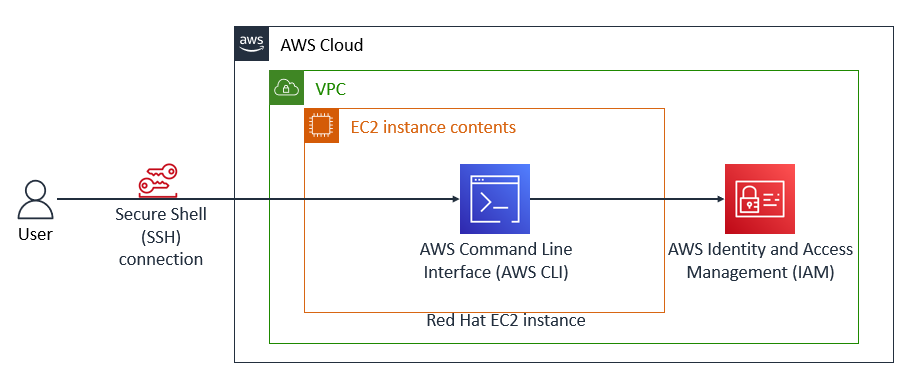
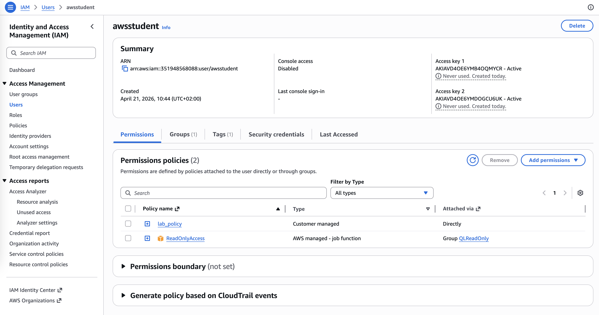

# Install and Configure the AWS CLI

This lab focuses on the installation, configuration, and practical use of the **AWS Command Line Interface (AWS CLI**), a powerful tool that enables 
users to interact with Amazon Web Services (AWS) directly from a command-line environment. The AWS CLI provides an efficient way to manage cloud resources, 
automate tasks, and control AWS services without relying on the graphical web console.

Here, the AWS CLI is installed on a Red Hat Linux-based Amazon Elastic Compute Cloud (EC2) instance, which does not include the CLI by default. 
This setup highlights the manual installation and configuration process required for certain instance types, in contrast to others such as Amazon Linux 
that come pre-installed with the tool. A **Secure Shell (SSH)** connection is established to remotely access and manage the instance.

Once connected, the AWS CLI is configured using access credentials that enable secure interaction with an AWS account. The lab then explores basic 
command-line operations by interacting with AWS Identity and Access Management (IAM), allowing users to manage identities and permissions programmatically.

At the end of this lab, the resulting architecture consists of a Virtual Private Cloud (VPC) containing a Red Hat EC2 instance with the AWS CLI installed and configured. 
Through an SSH connection, the user accesses this instance and uses the CLI to communicate with IAM services. The diagram below illustrates this architecture, 
showing the relationship between the local environment, the EC2 instance, and AWS services within the cloud infrastructure.



## Steps

1. I connect to the Red Hat EC2 instance by using SSH.
```bash
chiara@macbook-air:~/labs$ chmod 700 labsuser.pem 
chiara@macbook-air:~/labs$ ssh -i labsuser.pem ec2-user@35.93.48.118
The authenticity of host '35.93.48.118 (35.93.48.118)' can't be established.
ED25519 key fingerprint is SHA256:twvg2P0qHpbbuooZW2dcSQ6amXLRrwO7gcNXzefSbug.
This key is not known by any other names.
Are you sure you want to continue connecting (yes/no/[fingerprint])? yes
Warning: Permanently added '35.93.48.118' (ED25519) to the list of known hosts.
   ,     #_
   ~\_  ####_        Amazon Linux 2
  ~~  \_#####\
  ~~     \###|       AL2 End of Life is 2026-06-30.
  ~~       \#/ ___
   ~~       V~' '->
    ~~~         /    A newer version of Amazon Linux is available!
      ~~._.   _/
         _/ _/       Amazon Linux 2023, GA and supported until 2028-03-15.
       _/m/'           https://aws.amazon.com/linux/amazon-linux-2023/

[ec2-user@ip-10-200-0-4 ~]$ 
```

2. I install the AWS CLI on a Red Hat Linux instance.
```bash
[ec2-user@ip-10-200-0-4 ~]$ curl "https://awscli.amazonaws.com/awscli-exe-linux-x86_64.zip" -o "awscliv2.zip"
  % Total    % Received % Xferd  Average Speed   Time    Time     Time  Current
                                 Dload  Upload   Total   Spent    Left  Speed
100 66.6M  100 66.6M    0     0   206M      0 --:--:-- --:--:-- --:--:--  206M
[ec2-user@ip-10-200-0-4 ~]$ unzip -u awscliv2.zip
Archive:  awscliv2.zip
   creating: aws/
   creating: aws/dist/
   ...
   inflating: aws/dist/prompt_toolkit-3.0.51.dist-info/licenses/AUTHORS.rst  
   inflating: aws/dist/prompt_toolkit-3.0.51.dist-info/licenses/LICENSE  
[ec2-user@ip-10-200-0-4 ~]$ sudo ./aws/install
You can now run: /usr/local/bin/aws --version
[ec2-user@ip-10-200-0-4 ~]$ aws --version
aws-cli/2.34.33 Python/3.14.4 Linux/4.14.355-281.714.amzn2.x86_64 exe/x86_64.amzn.2
[ec2-user@ip-10-200-0-4 ~]$ 
```

To verify that the AWS CLI is now working, I run the `aws help` command. The help command displays the information for the AWS CLI.

3. I observe IAM configuration details in the AWS Management Console.

Within the IAM dashboard, the *awsstudent* user is selected from the Users section.



In the Permissions tab, I click on the *lab_policy* and examine it in JSON format to understand the specific permissions granted to the user.


The *lab_policy* broadly allows the *awsstudent* user to perform most actions across services like EC2, CloudFormation, CloudWatch, IAM (read-only), 
and SSM, while explicitly denying certain advanced or cost-related EC2 operations such as reserved instances, spot instances, and capacity reservations.

Next, in the Security credentials tab, the access key ID associated with the awsstudent user is located. It is important to note that secret access keys 
must normally be saved at the time of creation; however, for this lab, both the access key ID and secret access key are provided in the lab instructions.


4. I configure the AWS CLI to connect to my AWS Account:
```bash
[ec2-user@ip-10-200-0-4 ~]$ aws configure
AWS Access Key ID [None]: XXXXX
AWS Secret Access Key [None]: XXXXX
Default region name [None]: us-west-2
Default output format [None]: json
[ec2-user@ip-10-200-0-4 ~]$ 
```

5. Observe IAM configuration details by using the AWS CLI
```bash

```

## Challenge

## Conclusion
- I installed and configured the AWS CLI
- I connected the AWS CLI to an AWS account
- I accessed IAM by using the AWS CLI

## Additional resources
- [IAM AWS CLI Command Reference](https://docs.aws.amazon.com/cli/latest/reference/iam/index.html)
- [Installing or Updating the Latest Version of the AWS CLI](https://docs.aws.amazon.com/cli/latest/userguide/getting-started-install.html)
- [Troubleshooting AWS CLI Errors](https://docs.aws.amazon.com/cli/latest/userguide/cli-chap-troubleshooting.html)

## Useful AWS CLI commands
```bash
# Write the downloaded file to the current directory, option -o rename the file
curl "https://awscli.amazonaws.com/awscli-exe-linux-x86_64.zip" -o "awscliv2.zip"

# Unzip the installer, option -u option to skip prompts asking you to overwrite any existing files
unzip -u awscliv2.zip

# Run the install program - The sudo command grants write permissions to the directory
sudo ./aws/install

# Confirm the installation
aws --version

# Verify that the AWS CLI is now working - The help command displays the information for the AWS CLI - type q to exit
aws help
```
