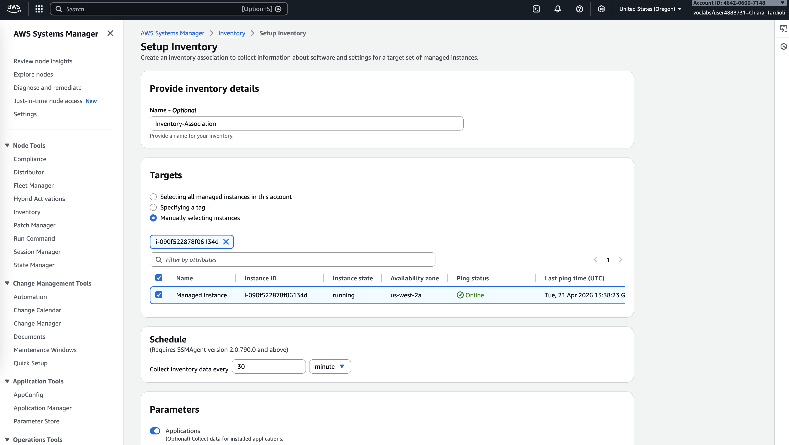
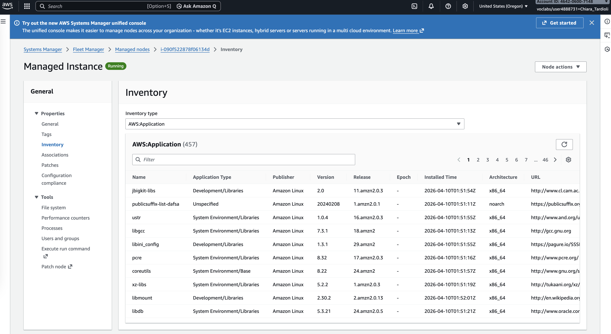
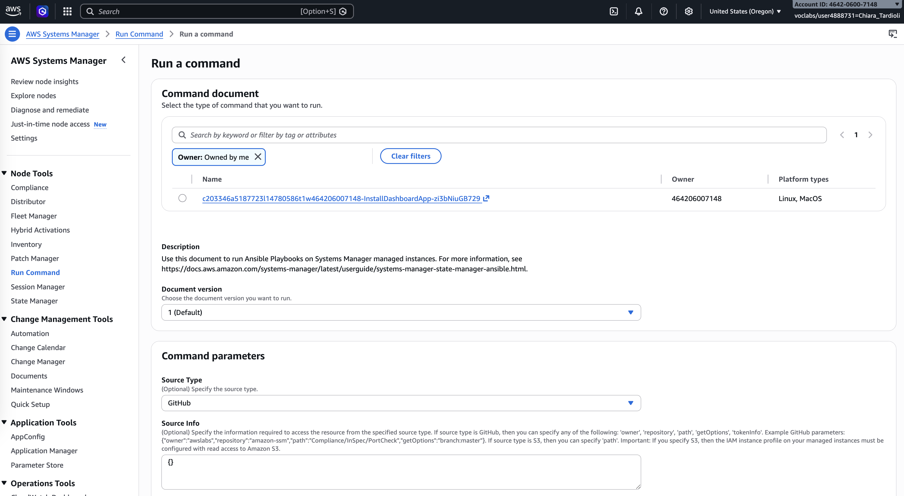
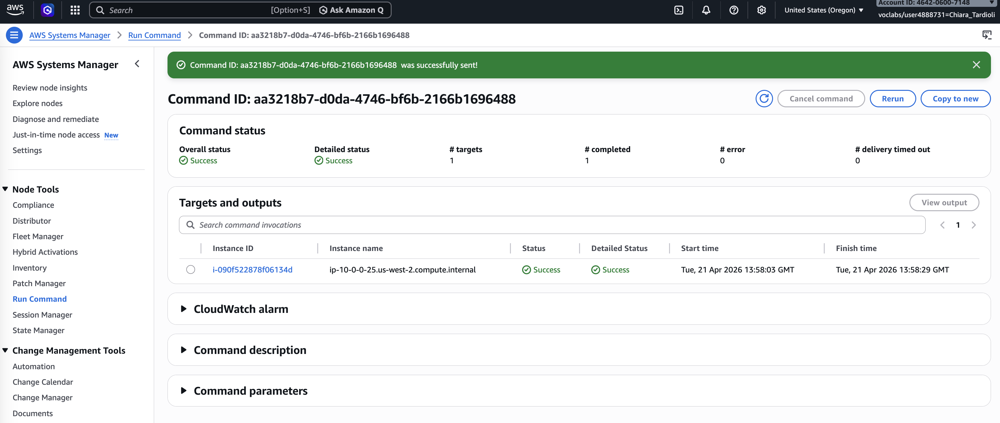
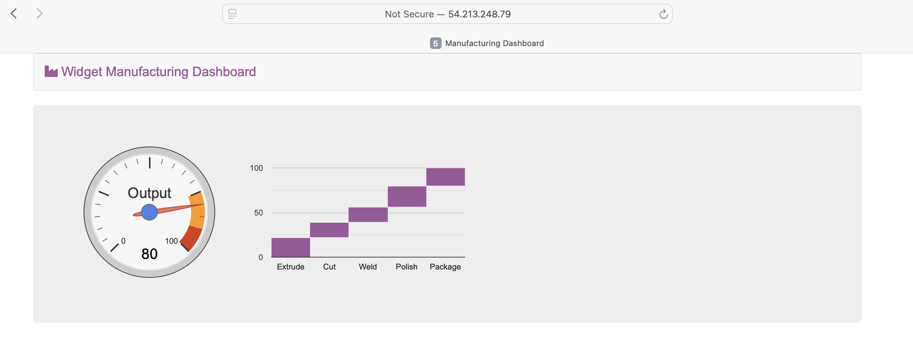

# AWS Systems Manager Lab Report

## Introduction
AWS Systems Manager is a collection of capabilities used to centralize operational data and automate tasks across Amazon Web Services (AWS) resources. 
It enables the configuration and management of Amazon EC2 instances, on-premises servers, virtual machines, and other resources at scale.  

This lab demonstrates how Systems Manager is used to manage infrastructure efficiently without requiring direct access (e.g., SSH), improving automation, 
security, and scalability.


## Environment Setup
The lab is conducted using the AWS Management Console. A pre-configured environment is provided, including:
- A Virtual Private Cloud (VPC)
- A managed EC2 instance
- AWS Systems Manager with required permissions


## Task 1: Generate Inventory Lists

I use *Fleet Manager* to collect inventory data from the managed EC2 instance.

I create an inventory association named **Inventory-Association** to gather:
- Operating system details  
- Installed applications  
- Instance metadata  



The collected data is now accessible through the *Inventory tab*, allowing inspection of installed software without connecting via SSH.




## Task 2: Install Application Using Run Command

I use the *Run Command* to install a custom application (Widget Manufacturing Dashboard) on the EC2 instance.

This process executes a predefined document that:
- Installs Apache web server  
- Installs PHP and AWS SDK  
- Deploys the web application  
- Starts the web server  



The last section, the AWS command line interface command section, displays the command line interface (CLI) command that initiates Run Command. 
This command is useful to run the command within a script rather than having to use the AWS Management Console.

```bash
aws ssm send-command \
  --document-name "c203346a5187723l14780586t1w464206007148-InstallDashboardApp-zi3bNiuGB729" \
  --document-version "1" \
  --targets '[{"Key":"InstanceIds","Values":["i-090f522878f06134d"]}]' \
  --parameters '{}' \
  --timeout-seconds 600 \
  --max-concurrency "50" \
  --max-errors "0" \
  --region us-west-2
```

After 1–2 minutes, the Overall status changes to *Success*.



I verify that the application is running using the instance’s public IP address in a browser.




## Task 3: Manage Configuration with Parameter Store

Parameter Store is used to manage application configuration.

A parameter is created:
- **Name:** `/dashboard/show-beta-features`  
- **Value:** `True`  

The application dynamically reads this parameter and enables additional features (a third chart).

📸 **Screenshot 6 – Parameter Creation**  


📸 **Screenshot 7 – Application with Beta Feature Enabled**  


(Optional) After deleting the parameter, the feature disappears.

📸 **Screenshot 8 – Application Without Beta Feature**  


**Outcome:**  
Application behavior is successfully modified without redeployment.

## Task 4: Access Instance Using Session Manager

Session Manager is used to securely access the EC2 instance via a browser-based shell.

Commands executed include:
- Listing application files  
- Retrieving metadata  
- Describing EC2 instances  

This method requires no SSH keys or open ports.

📸 **Screenshot 9 – Session Manager Start Session**  


📸 **Screenshot 10 – Command Execution in Session**  


**Outcome:**  
Secure, auditable access to the instance is achieved without traditional SSH.

## Results and Discussion

This lab demonstrates the advantages of AWS Systems Manager:
- Centralized infrastructure management  
- Reduced need for SSH access  
- Improved security and auditing  
- Automation of operational tasks  
- Dynamic configuration management  

## Conclusion

In this lab, I used AWS Systems Manager to:
- Verify configurations and permissions  
- Execute remote commands  
- Modify application settings dynamically  
- Access instances securely without SSH  

## Additional resources
- [What is AWS Systems Manager?](https://docs.aws.amazon.com/systems-manager/latest/userguide/what-is-systems-manager.html)
- [AWS Systems Manager Session Manager](https://docs.aws.amazon.com/systems-manager/latest/userguide/session-manager.html)
