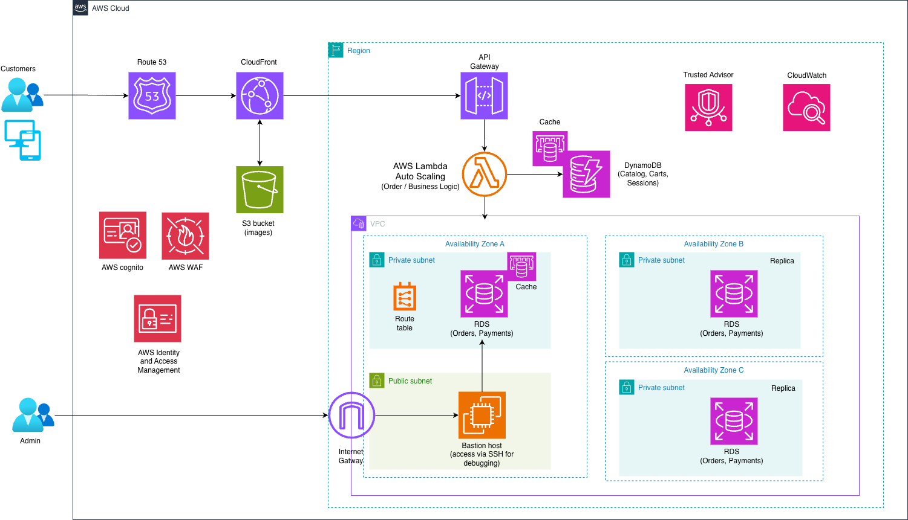

# Design a 3D E-Commerce Platform Architecture on AWS

## Scenario

We are a startup team launching a next-generation 3D e-commerce web application.  
This platform allows users to interact with 3D models of products (e.g., furniture, gadgets, fashion items) before purchasing.

Millions of users are expected globally, and the platform must be:
- Fast  
- Highly available  
- Secure  
- Cost-efficient  

As Cloud Practitioners, our goal is to design a scalable AWS architecture that meets these business and technical requirements.

---

## Architecture Overview



### Flow 1: Static & 3D Content Delivery
```

User → Route 53 → CloudFront → S3

```
- Route 53 routes users globally  
- CloudFront caches content at edge locations  
- S3 stores 3D models, images, and static assets  

---

### Flow 2: Secure API Requests
```

User → Route 53 → WAF → API Gateway → Cognito → Lambda

```
- WAF protects against web attacks  
- API Gateway handles API requests  
- Cognito manages authentication  
- Lambda executes backend logic  

---

### Flow 3: Data Layer (Optimized)
```

Lambda → ElastiCache → DynamoDB / RDS

```

#### Cache Behavior
- Lambda checks ElastiCache first  
- Cache hit → return response immediately  
- Cache miss → query database  
- Store result back in cache  

---

### Database Layer
- DynamoDB → sessions, product metadata, high-scale access  
- RDS (Multi-AZ, private subnet) → transactions, orders, structured data  

---

## Why We Chose Each AWS Service

- **Amazon S3**  
  Stores 3D assets (images and models). It is highly durable, scalable, and cost-efficient for static content.

- **Amazon CloudFront**  
  Delivers content globally with low latency using edge locations, improving load times for 3D assets.

- **Amazon Route 53**  
  Handles DNS and routes users to the closest or healthiest endpoint. It is a reliable and cost-effective routing service.

- **Amazon API Gateway**  
  Acts as the front door for applications to access backend services. Manages API traffic securely.

- **AWS Lambda**  
  Serverless compute service that runs code without managing servers. Scales automatically with pay-per-use pricing.

- **Amazon DynamoDB**  
  Stores dynamic data such as carts and sessions. Provides fast performance and automatic scaling for large workloads.

- **Amazon RDS (Multi-AZ)**  
  Fully managed relational database service that automates setup, backups, patching, and scaling. Multi-AZ ensures high availability.

- **Amazon VPC**  
  Provides a secure, isolated network environment with full control over networking, connectivity, and security.

- **Public Subnets**  
  Subnets with routes to an Internet Gateway, allowing public internet access.

- **Private Subnets**  
  Subnets without direct internet access, used to secure sensitive resources like databases.

- **Bastion Host**  
  Located in a public subnet. Provides secure administrative access to private resources (e.g., RDS) via SSH.

- **Internet Gateway (IGW)**  
  Enables communication between the VPC and the internet. Supports IPv4 and IPv6 traffic.

- **Amazon Cognito**  
  Provides authentication, authorization, and user management for web and mobile applications.

- **AWS Web Application Firewall (WAF)**  
  Protects applications by filtering malicious web traffic based on defined rules.

- **AWS Identity and Access Management (IAM)**  
  Manages secure access to AWS resources with fine-grained permissions.

- **Amazon CloudWatch**  
  Monitors logs, metrics, and system health. Helps track usage and set alerts.

- **AWS Trusted Advisor**  
  Analyzes the AWS environment and provides recommendations for cost optimization, performance, and security.

- **Cache Layer (ElastiCache)**  
  Improves performance by reducing database load and latency through in-memory caching.

---

## How the Architecture Meets the Requirements

### High Availability
- Multi-AZ deployment ensures redundancy across availability zones  
- RDS replication provides automatic failover  
- DynamoDB is inherently highly available  
- CloudFront and Route 53 improve availability and routing  

---

### Scalability
- AWS Lambda automatically scales based on demand  
- DynamoDB scales without manual intervention  
- CloudFront efficiently handles global traffic  

---

### Performance
- CloudFront caches content close to users  
- S3 provides fast access to 3D assets  
- Cache layer reduces database load  
- Serverless backend ensures fast responses  

---

### Security
- Cognito secures user authentication  
- WAF protects against attacks  
- VPC with private subnets isolates sensitive resources  
- Bastion host controls administrative access  
- IAM enforces least-privilege access  

---

### Cost Optimization
- Lambda uses pay-per-use pricing  
- S3 and CloudFront optimize storage and delivery costs  
- DynamoDB on-demand prevents over-provisioning  
- CloudWatch and Trusted Advisor help optimize usage  

---

## Design Trade-offs and Challenges

- **Lambda cold starts**  
  May introduce latency for infrequent requests  

- **Hybrid database approach (RDS + DynamoDB)**  
  - RDS provides strong consistency but at higher cost  
  - DynamoDB provides scalability but uses a different data model  

- **Skill requirements**  
  Developers must understand both:
  - SQL (RDS)  
  - NoSQL / JSON (DynamoDB)  

- **Cache management**  
  Requires proper cache invalidation strategies to avoid stale data  

- **Cost vs. performance balance**  
  Requires continuous monitoring and tuning  

- **Security complexity**  
  Multiple security layers increase system complexity but are necessary for protection  

---

## Final Takeaway

This architecture achieves:

- Serverless-first scalability and cost efficiency  
- Hybrid database strategy for performance and consistency  
- High-performance 3D delivery using CDN and caching  
- Strong security at every layer  
- A simple starting point with global scalability  
